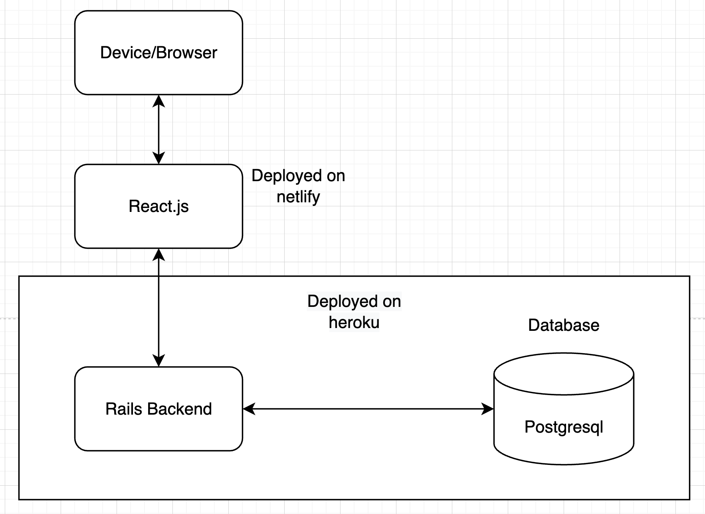

# T3A2 Part A - Jumping for Joy Application
## Team: Benedicte, Matthew and Adriana

### Description of Website
#### Purpose
The Jumping for Joy web application is designed to offer the business owner an easy way for both her and her customers to navigate the jumping castles she offers for hire, and to manage her bookings. Currently, she operates through email and social media messages, which is not as streamlined or simple as it could be. By building this web application, we will provide a digital space for customers to view all castles available at once, and request to book in for their preferred date. 

#### Functionality/Features
The key features of this application will be:
1. User authentication - to enhance site security.
2. Account roles - provide full CRUD authority to an administrator to manage jumping castle listings and booking information. At this point in the business model, there isn't really need for a customer account. However, there could potentially be in the future  if the client wanted an online checkout feature, for example. Since user authentication is a feature that is being built regardless, it would be wise to include roles at the same time so the application is adapatable and scalable. 
3. List castles for hire - in the style of a traditional e-commerce store, each jumping castle will have its own page with all the relevant details for the customer to browse. Instead of a 'shop now' button, there will be a 'request to book' button, where the customer will then fill out a form to make a booking request.
4. Submit a booking request - customers are able to send through a booking request for their jumping castle of choice. This will be executed by submitting a form with the required details (customer name, customer email, date of booking, booking duration, booking address, notes, chosen jumping castle). It was determined in discussion with the client that it would be better to make booking requests as opposed to a calendar/event like system, so the client could approve bookings on a case by case basis. As our client attends the hire site and sets the castles up herself, automating a schedule is not practical because each setup and travel time could be different which would require manual blocking/unblocking of availabilities on the customer-visible calendar. The pros and cons of using a form/request system were discussed with the client.

    **Pros:**
    - no need to manually update availabilities that the customer sees
    - chance to create one-on-one discussion with the customer and put a friendly name to the brand
    - screening booking requests for potential issues or complications - customer plans to use in an unideal location as an example, or doesn't consider access to power

    **Cons:**
    - each request needs to be manually assessed and responded to 
    - this model would not scale easily should the business grow to a point where there are multiple bookings per day
The client preferred a booking request in this instance, hence we will create this function. 

5. Administrative dashboard - this will be where the application administrator or client in this instance, can see all booking requests, manage and respond to these requests, as well as see who has or hasn't paid a deposit or any other relevant details. There will also be an option to see upcoming bookings.
6. Add bookings to Google Calendar - utilising the Google Calendar API, the business owner will be able to add bookings to her google calendar.

#### Target Audience
This application has three main target audiences:
1. Parents of young children who live in Brisbane. As a physical product, there is a limitation on the geographic location of users. While it is the children who use the product, these castles are hired out by the parents. 
2. Event/function planners. Jumping castles are an exciting feature of any outdoor, family-friendly event, and as such, it would be expected that people who plan events professionally would be expected to use this web application. 
3. The busiess owner. The administrative dashboard is designed to meet the needs of the business owner and hence the client will be the main user of the application. 

#### Tech stack
**Front-end:**
- React
- JavaScript
- Netlify (deploy)
- Styled Components - styling for the application

**Back-end:**
- Ruby
- Ruby on Rails (API)
- Heroku (deploy)

**Gems/packages:**
- CanCan - allows users to be assigned special permissions so only admin users can make changes to listings and view certain pages
- JWSToken - authenticates users
- Knock - authenticate users

**Third-party APIs:**
- Google Calendar API - so bookings can create Google calendar events for the Admin user
- EmailJS - to send email notifications to admin email for booking requests

**Planning and design:**
- Trello
- Adobe XD
- Lucidchart

### Dataflow Diagram

### Application Architecture Diagram

### User Stories
**Who:** Stella

**Position:** Customer
 
**Goals and Tasks:** To organise a jumping castle for her daughter's 7th birthday party
 
**Environment:** 

She is a mother of 2 children who would like to organise a great birthday party for her eldest daughter and her school friends. She has been organising all these details after work and while on breaks.
 
As a mother who is organising a birthday party for my daughter while juggling worklife and after school pickups, I would like to have easy access to all of the different options available and a point of contact to discuss all the available options and dates. Having a jumping castle for my daughter's birthday will really make the party a success and she will be the talk of the school. It's important that I can find a date that we can have this set up for us so we can organise the rest of the party around it.
 
So far, I have been talking with Megan on social media but it seems like she keeps forgetting the information we've discussed about dates previously. We might be looking to use another vendor but we'd really like to use Megan because she's been really friendly with us so far. Finding the castle which we wanted to hire was also difficult because we were scrolling through all sorts of posts about the company on her instagram page just trying to see the next listing. It would be so convenient to be able to see all of the available options in one place right next to each other so our family can compare them all side by side. 

**Who:** Megan

**Company:** Jumping For Joy

**Position:** Owner and Leaser
 
**Goals and Tasks:** To streamline the booking process of her business making it easier for her and her customers to organise dates to hire our her jumping castles
 
**Environment:** 

She is happy using technology to communicate with her customers but enjoys the social aspect of direct communication which also helps her build rapport with her clients and close more bookings
 
As a leaser or Jumping Castles, I want to be able to represent my brand online which I have done through social media platforms but I require a stable and fixed location to show my prospective clients that I am an established business.
 
To date, I have been able to present most of our options over Instagram, however new posts move our older posts further behind in our feed which prevents potential clients from seeing all that we have to offer and can make finding our contact details difficult.
 
I would like to present all of our offerings in an easy to find location that shows our business is established and makes it easier to discuss options with us.
 
Another feature we require is to have an easy to access location for the requested jumping castle and the dates the customer requires them to be on-site as well as the location. While talking with our customers on social media platforms, it is easy for this information to get lost amongst the chat. Having a form that they complete for us to access whenever we are discussing possible lease dates and locations would really help solve this issue.

**Who:** David

**Company:** Family Fun Weddings and Events

**Position:** Wedding Planner
 
**Goals and Tasks:** To organise fun, entertaining and surprising weddings for less traditional people who want more out of life than the run of the mill experience.
 
**Environment:** David works in an enthusiastic, fun but fast paced environment which can have his clients demanding more from his creative side and spontaneously moving dates around or changing what they want in an event.

As an event and wedding planner, my clients are generally very high demand and require tailored solutions to their events which are predominantly weddings. Our clients tend to lean towards the fun side and do offer us a bit of creativity and flexibility within our events but due to their spontaneity, when they want something done, it's important for our reputation that we are able to deliver and within their timeframe.
 
We have previously used Jumping for Joy as a supplier for jumping castles when the occasion demands it. We love the personality that Megan brings to her service but realistically, we have been using other suppliers more than her because it is simply easier to find what we're looking for when we use other sites. I'd really like to put more work through Megan but it can be cumbersome to sort through all her posts trying to find something specific for a client when other providers have ordered lists for us to browse.
 
We'd really love it if we could just bring up a list of all the jumping castles she has available and then discuss availability with her. It would make it easier for us to show to our clients as well.

### Wireframes

See inidividual wireframes

#### Home page

#### About/contact page

#### Admin login/create account

#### Admin dashboard

#### All Jumping Castles

#### Jumping Castle Cards

#### Customer enquiry form

#### Wireframe interation

### Trello screenshots

